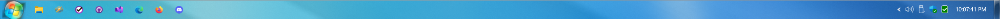
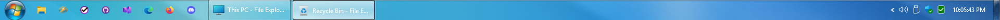

# RetroBar Windows 7 Theme

### An attempt at a Windows 7 taskbar for RetroBar

## About
This theme is a derivative of the RetroBar Windows Vista Aero theme XAML (Apache 2.0).
This is not 100% accurate, but I have completed the basics.

Always wanted a Windows 7 style theme for RetroBar, and decided that I should try giving it a shot.

## Contributions
Contributions welcome.

Todo list:

[x] Show Desktop button - Make it accurate.

[] Quick Launch - I can't increase the size of the icons on the quick launch.

[] NotifyTray - See about changing the icon.

[] Taskbar Button - Make the colour more accurate when button is clicked.