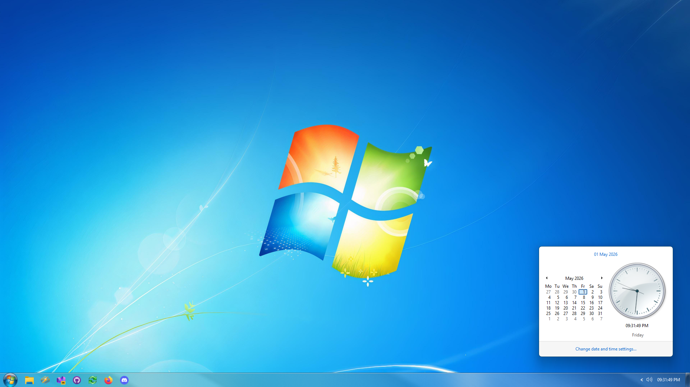
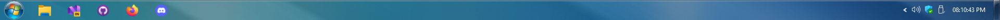
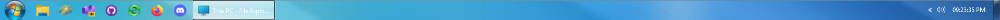

# RetroBar - Windows 7 Theme

### A Windows 7 Taskbar Theme for RetroBar. (for those people that are nostalgic about Windows 7)

## About

This theme is a Windows 7 inspired theme created for RetroBar, for those that are nostalgic for Windows 7 or want to customise their system with the best taskbar (imo).

Although it isn't 100% accurate, I've tried to make it as close as possible to the real thing by using image references and VMs; though more work is needed to make it as accurate as possible but I feel it is good enough, with only minor refinements remaining.

I've always wanted a Windows 7 style theme for RetroBar, and since there weren't any available, I decided that I should try giving it a shot.

# Installation
- Download the github repo and extract the contents to %localappdata%/retrobar
- Ensure that the Resources and the Themes folder exist in %localappdata%/retrobar after installation
- Start Retrobar
- Goto Retrobar settings, and select the "Windows 7 - Shown Label".

Extra:
- Click "Advanced" tab, and set the "Clock Click Action" to "Open Aero calendar" for the original calendar.

## Notice of Modification
This project is based on the Windows Vista Aero theme XAML file from the
RetroBar project, which is licensed under the Apache License 2.0.
Modifications have been made to make it a Windows 7 like theme.

## Customization

To edit the taskbar colour, edit the following line on the XAML file that is near the top:

    <!-- EDIT BELOW TO CHANGE COLOUR OF TASKBAR -->
    <!-- THEN CHANGE OPACITY ON TaskbarBackground and TaskbarVerticalBackground to change strength -->
    <!-- For no colour at all, set the colour to transparant and set opacity to 1 -->
    <SolidColorBrush x:Key="TaskbarTintColor" Color="#3c7eb1" /> 

The colour is in HEX value and supports transparency.

## Status

Windows 7 Taskbar Shown Label - Completed ✅ Only minor adjustments remain.

Windows 7 Taskbar Hidden Label - Completed ✅ Only minor adjustments remain.

## Contributions
Contributions and improvements welcome!

### Todo list:

✅ Show Desktop button - Make it accurate.

✅ Quick Launch - Make the quick launch icons the same size as the taskbar buttons for authenticity.

❌ NotifyTray - See about changing the icon to one that is more accurate.

✅ Taskbar Button - Make the colour more accurate when button is clicked.

✅ Taskbar Button [Hidden Label Version] - Make the padding and positioning correct.